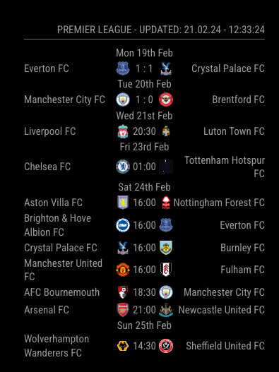
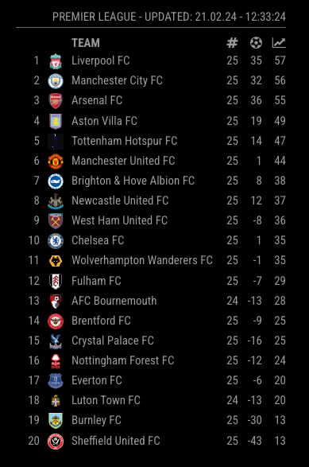
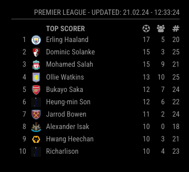

# MMM-All-Football
This [Magic Mirror Module](https://github.com/MichMich/MagicMirror) is partly based on [MagicMirror-FootballLeagues](https://github.com/master117/MagicMirror-FootballLeagues). However the functionality has been changed and you are now able to view top scorers of a league and it integrates with the v4 of [football-data.org](https://api.football-data.org/index)

## Preview

### Matches



### Tables 


### Top scorers



## Installation

Navigate into your MagicMirror's modules folder and execute 
```git
git clone https://github.com/ChristianThingKnudsen/MMM-All-Football
```

Install fetch
```nodejs
npm install node-fetch
```


## Configuration
This module uses the MagicMirror standard configuration file config.js. Available options are:

| Option | Values |
| - | - |
| apiKey | Api-Key for [football-data.org](https://api.football-data.org/index) the API used for aquiring data. A free API key can be aquired [here](https://api.football-data.org/client/register). |
| leagues | List of league-ID's you want to display. If you put more than one league the module switches automatically between them. A table with possible leagues and the related ID's can be found further down. <br><br> <b>Type:</b> String <br> <b> Example: </b> `[ "PL", "CL" ]` 1. Premier league, 2. Champions leage <br> <b> Default: </b> `[ "PL" ]` |
| displayTime | Defines how long one view is shown in milliseconds. <br><br><b> Default Value: </b> `60 * 1000` which is 6000 ms or 1 min. |
| showTables | Toggles if tables are shown if the league has a table. <br><br><b> Default Value: </b> `true` |
| showTopScorers | Toggles if you want to see top scorers of the selected leagues. <br><br><b> Default Value: </b> `false` |

Here is an example of an entry in `config.js`

```javascript
{
	module: 'MMM-All-Football',
	position: 'top_right',
	header: 'My Leagues',
	config: {
		leagues: ["PL", "CL"],
		displayTime: 60 * 1000,
		showTables: true,
		showTopScorers: true,
		apiKey: 'MySuperSecretKey'
	}
},
```

### Data Source (v4)
All Data is from: [football-data.org](https://www.football-data.org/)

Sadly football-data.org has introduced [Tiers and Pricing](https://www.football-data.org/pricing)
which means:

1. You need a key from their site to use this tool. A free API key can be aquired [here](https://api.football-data.org/client/register).

2. There is only a few leagues available, only 10 updates per minute and delayed scores (not live) in the free version.

### Available  Leagues
All Updated League Codes [can be found here](http://api.football-data.org/v4/competitions/). Some examples: 

| Code | League |
| - | - |
| "PL" | Premier League |
| "WC" | FIFA World Cup |
| "EC" | European Championship |
| "CL" | UEFA Champions League |
| "FL1" | Ligue 1 |
| "BL1" | Bundesliga |
| "SA" | Serie A |
| "PD" | Primera Division |


